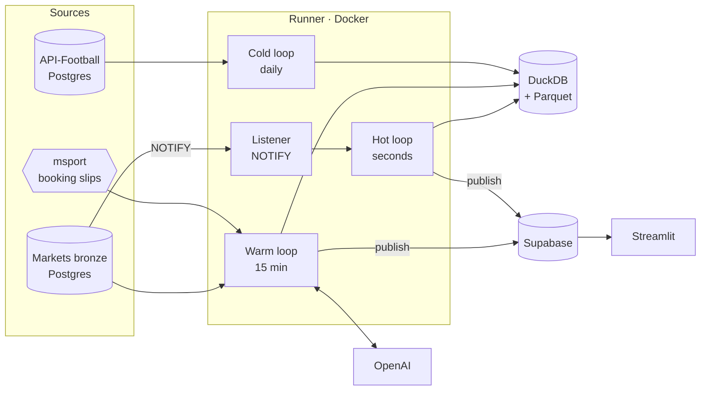
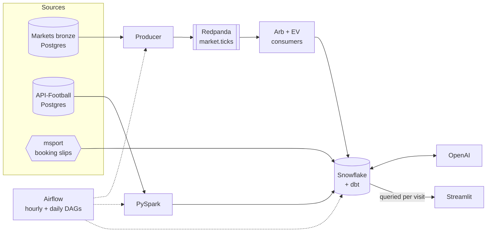

# arbibet-capstone

Cross-bookmaker market signals for football: arbitrage, positive expected value
and booking-slip analysis across five bookmakers, served on a public dashboard.

Built as the capstone for the Ironhack Data Engineering bootcamp (Jul–Sep 2026).
Dashboard: <https://arbibet.streamlit.app>

> Sports data and market signal, not betting infrastructure. Bookmaker prices
> are the highest-frequency signal in the domain; the outputs are about market
> efficiency and insight. This is a reference implementation.

## What it does

- **Normalises five bookmakers onto one market taxonomy.** Three publish
  betradar identifiers; bet9ja and livescorebet use proprietary schemes. A
  236-row crosswalk makes cross-book comparison possible.
- **Detects surebets and positive EV within seconds** of a bookmaker publishing
  a new price, refusing stale legs, suspended markets and in-play fixtures.
- **Settles history.** Match statistics and 6.2M settled team markets from
  API-Football give each slip leg and fixture a measured base rate.
- **Explains.** `gpt-4o-mini` writes pre-match briefs, slip verdicts and
  post-match notes from warehouse data only, shown beside the numbers they cite.
- **Observes itself.** Every job and component is recorded and shown on a
  Pipeline health page.

## Architecture

### Current (from 17 September 2026)



### Previous (to 17 September 2026)



### Why it changed

| | Previous | Current |
|---|---|---|
| Warehouse | Snowflake | DuckDB, local file (79 MB + 4 MB Parquet) |
| Orchestration | Airflow, hourly | One runner process, event-driven |
| Signal latency | Up to an hour | Seconds, on Postgres NOTIFY |
| Dashboard data | Queried from Snowflake per visit | Documents published to Supabase |
| Observability | Airflow UI | `ops` tables and a Pipeline health page |
| Running cost | $212 of trial credit in 16 days | $0 infrastructure |

The data (221 MB) never needed a cloud warehouse; the cost was compute kept
awake by frequent small jobs and a polling dashboard. DuckDB runs the same dbt
models locally, verified by identical gold row counts after migration.
Snowflake is retained as a record; its code is tagged `snowflake-final`.

## How the pipeline runs

The runner (`runner/main.py`) is a single process, because DuckDB allows one
writer. Every job, including dbt and Spark, runs inside it.

| Loop | Trigger | Work |
|---|---|---|
| Hot | NOTIFY from bronze; 15 s poll fallback | Recompute arbitrage and EV for the changed fixture, store, publish |
| Warm | Every 15 min | Dimensions, slips, price history, arbitrage tracking, live state, dbt, AI summaries, publish |
| Cold | Daily 06:00 Berlin | Spark flatten and settle, dbt build and tests, slip compaction, backup, pruning |

Writes are MERGEs on natural keys, so any job can be re-run. Failed jobs are
recorded and retried on the next cycle.

## Operations

```bash
docker compose up -d --build runner              # start; restarts with Docker
docker compose logs -f runner                    # logs
docker exec arbibet-runner python -m runner.status
```

- `ops.job_run` records every execution: duration, rows, errors, and hot-loop
  latency from payload to stored signal.
- `ops.heartbeat` holds the last beat per component.
- Both are mirrored to Supabase and shown on the Pipeline health page.

The warehouse lives in the `arbibet-warehouse` Docker volume. In Supabase, the
tables are in the `serving` and `ops` schemas with row-level security; the
dashboard uses a read-only role (`sql/supabase_dashboard_role.sql`).

## Setup

```bash
cp .env.example .env        # source DSNs, OPENAI_KEY, SUPABASE_DB_URL
py -3.12 -m venv .venv
.venv/Scripts/python.exe -m pip install -e ".[dev,spark]" duckdb dbt-duckdb
pytest
python scripts/install_bronze_notify.py
docker compose up -d --build runner
```

Streamlit secrets: `SUPABASE_HOST`, `SUPABASE_PORT`, `SUPABASE_USER` and
`SUPABASE_PASSWORD` for the `dashboard_reader` role.

## Repository

| Path | Contents |
|---|---|
| `runner/` | Listener, loops, Supabase publisher, observability, Docker image |
| `src/arbibet_capstone/` | Bronze reader, crosswalk and parsers (vendored), signals, warehouse layer |
| `dbt/` | Staging and gold models with tests |
| `spark/` | Match-history flatten and market settlement |
| `odds/`, `slips/`, `enrich/` | Price history, slip ingestion, AI summaries |
| `publish/snapshot.py` | Builds the published documents |
| `dashboard/` | Streamlit app |
| `sql/` | DuckDB schema, NOTIFY trigger, Supabase role |
| `snowflake/`, `airflow/`, `producer/`, `consumers/` | Previous architecture, kept for reference |
| `web/` | Next.js front end over the same documents; not deployed |
| `docs/FINDINGS.md` | Investigation log |

## Findings

- **True surebets are rare.** Early runs flagged 174 opportunities up to 7.83×;
  all were crosswalk defects. After fixes and a five-minute leg-freshness rule,
  35 true surebets remain, mostly in obscure markets.
- **Stale legs create false arbitrage.** Bronze stores a price only when it
  changes, so legs can be hours apart. All 48 implausible signals had legs more
  than five minutes apart; the detector now refuses them.
- **Popularity does not track soundness.** A slip copied 5,739 times had a
  1-in-411,956 chance; the most-copied slip on the same fetch was 1-in-13.

## Limitations

- Historical rates cover at most ten matches and ignore opponent strength.
- EV for books without a published probability uses a borrowed one.
- Slip legs vanish at kick-off, so a stored slip is its remaining, bettable part.
- xG exists for a minority of leagues.
- Freshness depends on the pipeline machine being on; otherwise the dashboard
  shows the last published data.

## Credits and cost

The bronze collectors, fixture matcher, bookmaker parsers, crosswalk, arbitrage
engine and settlement engine predate this project and are vendored; everything
around them is this repository. Infrastructure runs on free tiers (DuckDB,
Supabase, Streamlit). OpenAI usage was about $1 to mid-September 2026.
