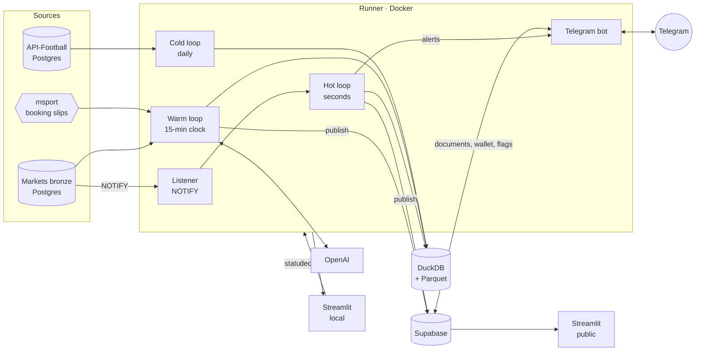
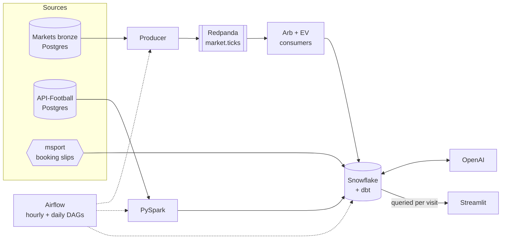

# arbibet-capstone

Cross-bookmaker market signals for football: arbitrage, positive expected value
and booking-slip analysis across five bookmakers, delivered on Telegram within
seconds and explained on a public dashboard.

Built as the capstone for the Ironhack Data Engineering bootcamp (Jul–Sep 2026).
Dashboard: <https://arbibet.streamlit.app> · Bot: `@Arbibbobobot`

> Sports data and market signal, not betting infrastructure. Bookmaker prices
> are the highest-frequency signal in the domain; the outputs are about market
> efficiency and insight. This is a reference implementation.

## What it does

- **Normalises five bookmakers onto one market taxonomy.** Three publish
  betradar identifiers; bet9ja and livescorebet use proprietary schemes. A
  236-row crosswalk makes cross-book comparison possible.
- **Detects surebets and positive EV within seconds** of a bookmaker publishing
  a new price, refusing stale legs, suspended markets and in-play fixtures.
- **Alerts on Telegram, sized to your money.** Each alert carries the legs, bet
  links and stakes sized to the subscriber's balance at each book. A wallet
  records placed bets, real and paper, and settles them from the platform's
  own results.
- **Shows its track record first.** A paper wallet placed on every signal,
  compounding, beside how the most-copied booking slips actually did.
- **Gives every fixture one page.** Its surebets and EV over time, every book's
  prices, both sides' form, settled markets and what punters backed. Every
  alert, table row and slip leg links to it.
- **Settles history.** Match statistics and 6.2M settled team markets from
  API-Football give each slip leg and fixture a measured base rate.
- **Explains.** `gpt-4o-mini` writes pre-match briefs, slip verdicts and
  post-match notes from warehouse data only, shown beside the numbers they cite.
- **Guards against wrong matches.** Books that seem to price a different match
  under a fixture's id are queued for review; a person excludes them, locally
  or from Telegram.
- **Observes itself.** Every job and component is recorded; health is shown on
  the public dashboard and on a local one.

## Architecture

### Current (from 17 September 2026)



### Previous (to 17 September 2026)



### Why it changed

| | Previous | Current |
|---|---|---|
| Warehouse | Snowflake | DuckDB, local file (about 120 MB + Parquet) |
| Orchestration | Airflow, hourly | One runner process, event-driven |
| Signal latency | Up to an hour | Seconds, on Postgres NOTIFY |
| Delivery | Dashboard only | Telegram alerts, then the dashboard |
| Dashboard data | Queried from Snowflake per visit | Documents published to Supabase |
| Observability | Airflow UI | `ops` tables, health pages, a local dashboard |
| Running cost | $212 of trial credit in 16 days | $0 infrastructure |

The data (221 MB) never needed a cloud warehouse; the cost was compute kept
awake by frequent small jobs and a polling dashboard. DuckDB runs the same dbt
models locally, verified by identical gold row counts after migration.
Snowflake is retained as a record; its code is tagged `snowflake-final`.

## How the pipeline runs

The runner (`runner/main.py`) is a single process, because DuckDB allows one
writer. Every job, including dbt and Spark, runs inside it.

| Loop | Trigger | Work |
|---|---|---|
| Hot | NOTIFY from bronze; 15 s poll fallback | Recompute arbitrage and EV for the changed fixture, store, alert, publish |
| Warm | :00, :15, :30, :45 (an overrun starts the next at once) | Dimensions, match checks, slips, price history, arbitrage tracking, live state, settlement pass 1 (and pass 2 hourly), dbt, AI summaries, bet settlement, publish |
| Cold | Daily 06:00 Berlin | Spark flatten and settle, settlement pass 2, dbt build and tests, slip compaction, backup, pruning |

- Writes are MERGEs on natural keys, so any job can be re-run. A failed job is
  recorded and retried on the next cycle.
- Warm jobs yield to the hot loop while it recomputes; median latency from a
  stored price to a stored signal is 3–5 s.
- The runner joins the source databases' Docker networks. Through
  `host.docker.internal` bronze payloads moved at 0.8 MB/s; direct, a cycle's
  price history is fetched in under a minute.

### Wrong matches

The matcher upstream occasionally files two fixtures under one event id (same
country, same kick-off), which makes two unrelated prices read as a surebet. A
real bet was placed on one before this existed.

- **Review queue.** Each book's payload names its teams; they are compared with
  the fixture's by name (`src/arbibet_capstone/verify.py`). A book that seems
  to list a different match becomes a *candidate* in `core.fixture_check`.
  Nothing is excluded automatically: club aliases and rebrands make automatic
  verdicts wrong too often. An optional model check (`VERIFY_WITH_MODEL=1`,
  gpt-4o-mini confirmed by gpt-4o) only adds candidates.
- **Decisions.** A person excludes or clears a candidate on the local
  dashboard. A signed Telegram user can flag a whole fixture with **⚠️ Wrong
  match** on any alert, surebet card or EV row, after a confirm step showing
  what each book lists; `/flags` restores it.
- **Effect.** An excluded book, or a flagged fixture, yields no arbitrage and
  no EV anywhere: hot loop, price history, tracking, dbt, publish, Telegram.
  Its stored signals are removed, and the decision is recorded with who made it.

### Settlement

Settlement is driven by demand: only the outcomes that an EV signal, a surebet
leg, a slip leg or a wallet bet refers to are settled, a few thousand rows a
day, into `core.fact_outcome_result`. Two passes write it.

**Pass 1, about two hours after kick-off** (`odds/settle_fast.py`, every warm
cycle). Neither collector records a finished match (markets bronze stops at
kick-off; the live collector follows a few competitions), but msport's
match-detail endpoint keeps answering with `Ended`, the final score and the
half-time score. That score is fetched once per fixture and the vendored
engine settles every demanded market a scoreline decides, any family, period
or line, as `provisional`. It refuses rather than guesses: only `Ended`, only
normal-time matches, only when the match check accepts msport's teams as the
fixture's, never a flagged fixture.

**Pass 2, when API-Football's results arrive** (`odds/settle_confirm.py`). The
ingestor runs daily at 02:00 UTC; the cold loop flattens its results into
`fact_team_match` at 04:00 and runs pass 2 straight after. The warm loop runs
it again hourly for demand that turns up after the result did. It re-settles
the same demand from API-Football's period scores and, per outcome:

| Stage | Meaning |
|---|---|
| `confirmed` | Pass 1 said the same. The verdict stands; who confirmed it, when and on what score is recorded. |
| `corrected` | Pass 1 said otherwise. API-Football wins, pass 1's verdict is kept in `previous_verdict`, and a wallet bet already paid on it is re-paid: the difference moves on each book's balance and the bet's note says why. |
| `disputed` | Pass 1 said otherwise, but the teams API-Football names are not recognisably the fixture's. A wrong link is as likely as a wrong score, so the verdict is left alone and retried. |
| `confirmed`, source `apifootball` | Pass 1 never settled it: no msport id, unverified teams, extra time or penalties, a fixture outside pass 1's 36 hours, or a market a scoreline cannot decide. Corner totals settle here, from match statistics, for matches that ended in normal time. |

A `confirmed` or `corrected` outcome is final and never looked at again, so
pass 2 is idempotent and reads the warehouse only. dbt (`gold_ev_settled`,
`gold_slip_leg_history`) and the wallet read the final verdict when there is
one, then `fact_team_market_result`, then pass 1's.

`spark/settle.py` still writes `fact_team_market_result`, one verdict per team
for five families (1x2, double chance, both teams to score, total goals,
draw no bet) across all history. That table is the form dimension ("over 2.5
in 7 of the last 10"), not the settlement of signals.

Measured on 21 September 2026 (fixtures kicked off at least three hours
earlier; pass 2 run against that morning's backup):

| | Before (19 Sep) | Pass 1 only | Both passes |
|---|---|---|---|
| EV signals with a result | 40% | 58% | 82% |
| Slip legs with a result | 74% | | 93% |

- Pass 1 writes a verdict a median 2.1 hours after kick-off (90th percentile
  2.3). Of 609 ended fixtures it polled, 560 were settled, 49 refused for
  unverified teams and 8 for a missing half-time score.
- Where both sources had the match: 299 of 299 final and half-time scores
  agree, and 1,029 of 1,029 provisional verdicts were confirmed. No
  corrections, no disputes so far.
- Pass 2's first run wrote 9,345 verdicts in one second: 8,316 new (1,738
  fixtures), among them 215 corner totals and 99 outcomes of matches that went
  to extra time or penalties. All 5,635 that overlap `fact_team_market_result`
  match it.
- What still has no result: API-Football has no finished result yet (10% of EV
  signals; 89% of linked fixtures have one a day after kick-off, 98% after
  four), the fixture was never linked to API-Football (8%), and families the
  engine does not implement (`1x2_ten_minute_interval`, `next_goal`,
  `last_goal`, a few combination markets; under 1%).

## Dashboards

**Public** (<https://arbibet.streamlit.app>), reading documents in Supabase:

| Page | Shows |
|---|---|
| Track record | The paper wallet on every signal; how copied slips fared |
| Market signals | Upcoming surebets with stake sizing; EV with **Fair odds** linked to the source book; backtest; market efficiency |
| Betting slips | Most-slipped fixtures; popular slips leg by leg with AI verdicts |
| Pipeline health | Heartbeats, hot-loop latency, failures, job durations, bot activity |
| Event page (`/fixture?event_id=`) | One fixture: surebets and EV over time, prices, form, settled markets, punters |

**Local** (`python -m streamlit run dashboard/local.py`), reading `data/local/`
(bind-mounted from the runner): pipeline health and the match-review queue.
Decisions are written to `decisions.json`; the runner applies them within a
minute. Nothing local touches DuckDB or the cloud.

## Telegram bot

Two threads inside the runner (`runner/telegram/`). Alerts are handed over
in-process by the hot loop, so they leave seconds after a price; commands read
the same Supabase documents as the dashboard and never touch DuckDB.

- **Alerts:** a true surebet (arbitrage above 1, legs within five minutes), or
  EV at or above the subscriber's threshold (default 0.015), before kick-off,
  never on a flagged leg or fixture. Sent once per market or outcome, and
  again only if the value improves by 0.005 (surebet) or 0.02 (EV).
- **Each leg shows what its book lists.** Under every leg is the teams and
  competition that bookmaker itself files the fixture under, marked ✅ (names
  match the fixture), ⚠️ (they do not) or ❔ (the book names none) and linked
  to its page, so a merged fixture shows as two different matches without
  opening anything. For EV the same line sits under the bet and under "Fair
  odds". A ⚠️ adds "lists a different match"; nothing is excluded by it.
- **Wallet:** `/balance msport 50000` records cash at a book; alerts are then
  sized to it (the largest split every leg's balance allows, the binding book
  named). **Placed** records the bet; `/placed 4700 5000` corrects the stakes;
  **Odds changed** re-splits at the site's prices; **Paper** does the same in
  a practice wallet. `/wallet` shows equity, locked-in profit and settled P&L.
  Bets settle in the warm loop from `fact_team_market_result`, leg by leg.
- **Links, not charts.** History, prices and slip legs open the fixture's event
  page. In EV messages "fair odds" links to the fixture at the book the
  probability came from.
- **Access:** anyone may read; sizing, the wallet, Placed and Wrong match need
  a balance set; the owner (`TELEGRAM_OWNER_CHAT`) has `/admin`.
- **Commands:** `/surebets`, `/ev 0.02`, `/wallet`, `/balance`, `/placed`,
  `/odds`, `/stake 100 2.10 1.95`, `/slips`, `/dive <search>`, `/flags`,
  `/health`, `/settings`, `/start`, `/stop`.
- **State:** `bot.subscriber`, `bot.alert`, `bot.balance`, `bot.bet` and
  `bot.report` in Supabase, with row-level security and no dashboard access.
  "Not on site" flags go to `serving.leg_flag`, shared with the dashboard.

Create a bot with @BotFather and set `TELEGRAM_BOT_TOKEN` in `.env`; the bot
is off without it. `TELEGRAM_ALLOWED_CHATS` optionally restricts who may use it.

## Operations

```bash
docker compose up -d --build runner              # start; restarts with Docker
docker compose logs -f runner                    # logs
docker exec arbibet-runner python -m runner.status
python -m streamlit run dashboard/local.py       # health and match review
```

- `ops.job_run` records every execution: duration, rows, errors, and hot-loop
  latency from payload to stored signal. `ops.heartbeat` holds the last beat
  per component. Both are mirrored to Supabase every minute.
- The warehouse lives in the `arbibet-warehouse` Docker volume; `data/local/`
  is the only host-visible folder. In Supabase, `serving` and `ops` are read
  by the dashboard's read-only role (`sql/supabase_dashboard_role.sql`); `bot`
  is not.
- The public app applies a push inside its running process; `dashboard/app.py`
  reloads shared modules that changed, so a deploy needs no reboot.

## Setup

```bash
cp .env.example .env        # source DSNs, OPENAI_KEY, SUPABASE_DB_URL, TELEGRAM_BOT_TOKEN
py -3.12 -m venv .venv
.venv/Scripts/python.exe -m pip install -e ".[dev,spark]" duckdb dbt-duckdb
pytest
python scripts/install_bronze_notify.py
docker compose up -d --build runner
```

Streamlit secrets: `SUPABASE_HOST`, `SUPABASE_PORT`, `SUPABASE_USER` and
`SUPABASE_PASSWORD` for the `dashboard_reader` role.

## Repository

| Path | Contents |
|---|---|
| `runner/` | Listener, loops, Supabase publisher, match-review queue, observability, Docker image |
| `runner/telegram/` | Alerts, commands, wallet, settlement |
| `src/arbibet_capstone/` | Bronze reader, crosswalk and parsers (vendored), signals, match verification, warehouse layer |
| `dbt/` | Staging and gold models with tests |
| `spark/` | Match-history flatten and market settlement |
| `odds/`, `slips/`, `enrich/` | Price history, slip ingestion, AI summaries |
| `publish/snapshot.py` | Builds the published documents |
| `dashboard/` | Public Streamlit app (`app.py`, `views/`) and the local one (`local.py`) |
| `sql/` | DuckDB schema, NOTIFY trigger, Supabase role |
| `snowflake/`, `airflow/`, `producer/`, `consumers/` | Previous architecture, kept for reference |
| `web/` | Next.js front end over the same documents; not deployed |
| `docs/FINDINGS.md` | Investigation log |

## Findings

- **True surebets are rare.** Early runs flagged 174 opportunities up to 7.83×;
  all were crosswalk defects. After fixes and a five-minute leg-freshness rule,
  a few dozen true surebets remain, mostly in obscure markets.
- **Stale legs create false arbitrage.** Bronze stores a price only when it
  changes, so legs can be hours apart. All 48 implausible signals had legs more
  than five minutes apart; the detector now refuses them.
- **Merged fixtures create false arbitrage too.** In one 30-hour window, 3 of
  about 150 upcoming fixtures held two different matches under one id. Name
  checks find them; a model asked to judge club aliases was wrong often enough
  that exclusion is left to a person.
- **Small edges compound.** A paper wallet on every signal since 2 September
  2026 (surebets of 1.5% or more at 20% of bankroll, EV at quarter-Kelly) grew
  ₦100,000 to about ₦168,000 over 13 surebets and 83 EV bets, with a 13% worst
  drawdown. It assumes every price was taken at detection.
- **Popularity does not track soundness.** Of 1,520 settled copied slips, 32%
  won (27% weighted by copies) although 65% of their legs did. A slip copied
  5,739 times had a 1-in-411,956 chance.

## Limitations

- Historical rates cover at most ten matches and ignore opponent strength.
- EV for books without a published probability uses a borrowed one.
- Slip legs vanish at kick-off, so a stored slip is its remaining, bettable part.
- xG exists for a minority of leagues.
- A merged fixture is caught only after a person reviews it; until then its
  signals are live. Check each bet link names the same match.
- Freshness depends on the pipeline machine being on; otherwise the dashboard
  shows the last published data and no alerts are sent.

## Credits and cost

The bronze collectors, fixture matcher, bookmaker parsers, crosswalk, arbitrage
engine and settlement engine predate this project and are vendored; everything
around them is this repository. Infrastructure runs on free tiers (DuckDB,
Supabase, Streamlit). OpenAI usage was about $1 to mid-September 2026.
