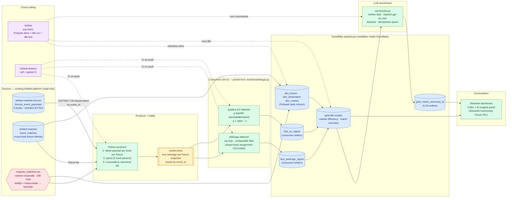

# arbibet-capstone

**Sports Information Platform — a minimum-viable data engineering reference implementation.**

Reads the append-only bronze layer of an existing multi-bookmaker collection
platform, normalises five bookmakers' incompatible market schemes into a single
canonical market/outcome taxonomy, publishes canonical per-fixture price
snapshots to Kafka, fans out to per-signal consumers writing Snowflake facts,
transforms with PySpark and dbt into a gold layer, enriches it with
LLM-generated match summaries through an orchestrated Airflow task, and serves a
Streamlit dashboard.

Built as the capstone for the Ironhack Data Engineering bootcamp (Jul-Sep 2026),
in a 2.5-day focused sprint. Full plan: [`docs/capstone-plan.md`](docs/capstone-plan.md).

> **Data framing.** Sports data and market signal, not betting infrastructure.
> Bookmaker prices are used as the highest-frequency signal source available in
> the domain; the analytical outputs are about market efficiency, per-source
> drift, and insight generation. This is a reference implementation, not a
> production consumer service.

---

## Architecture



**Reading key:** solid arrows = data flow; dashed = cross-cutting concerns.
Yellow = Kafka topic; blue = data stores; green = processors; pink = reference
data; purple = orchestration and CI.

### The problem this platform actually solves

Three of the five bookmakers publish market and outcome identifiers from the
betradar taxonomy natively. Two -- bet9ja and livescorebet -- publish
proprietary schemes: bet9ja keys markets as strings like `S_OU@2.5`,
livescorebet as integer `type` codes. Until those are reconciled no
cross-bookmaker comparison is possible at all, because "Over 2.5 goals" is a
different string at every book.

A 236-row crosswalk maps both dialects onto the betradar space. Everything
downstream -- arbitrage detection, positive-EV screening, the gold aggregates --
is only meaningful because that reconciliation happened first.

---

## Repository layout

| Path | What it is |
|---|---|
| `src/arbibet_capstone/bronze.py` | Reads the latest payload per bookmaker for one fixture |
| `src/arbibet_capstone/crosswalk/` | **Vendored** parsers, arbitrage engine, and the crosswalk CSV |
| `producer/` | Bronze to parse to canonical snapshot to Kafka |
| `consumers/` | `arb.py` and `ev.py`, one signal each, both writing Snowflake facts |
| `spark/` | PySpark dimension refresh |
| `dbt/` | Staging and gold models, plus the tests that enforce the schema |
| `enrich/` | LLM summariser, run as an Airflow task |
| `airflow/dags/` | One DAG: dims -> dbt run -> dbt test -> summaries |
| `dashboard/` | Streamlit app |
| `snowflake/ddl.sql` | Warehouse schema |
| `scripts/go_no_go.py` | The gate that proves cross-book resolution works |

---

## Quickstart

<!-- DAY 2: fill in once docker-compose boots the full stack. -->

```bash
cp .env.example .env          # then fill in real values
pip install -e ".[dev]"
pytest
```

---

## Honesty statement

<!-- DAY 2: expand. Every point below is already true; the job is wording. -->

- **What was reused, not built.** The bronze layer, the cross-book fixture
  matcher, the five bookmaker parsers, the market crosswalk, and the
  arbitrage/EV engine all predate this capstone and belong to the wider Arbibet
  platform. This repository is the pipeline *around* them: ingestion into Kafka,
  the warehouse schema, transformation, orchestration, enrichment, CI, and the
  dashboard.
- **What is genuinely new here.** The bronze-to-Kafka producer, both consumers,
  the Snowflake schema and dbt models, the LLM summariser, the Airflow DAG, the
  CI workflow, and the Streamlit dashboard.
- **Authorship.** Architecture, specifications and verification are the
  author's; much of the implementation was produced through a spec-driven
  coordinator-implementor-verifier workflow with AI implementors.
- **Signal quality.** Bronze writes a row only when a payload *changes*, so the
  latest price per book can be minutes old. `leg_spread_seconds` on
  `fact_arbitrage_signal` records that staleness rather than hiding it. A
  detected arbitrage is a historical observation, not a claim the bet was
  placeable.
- **Scope deferred, not lost.** AWS, IaC, Iceberg, NiFi, Spark Structured
  Streaming and Great Expectations are absent by decision. See the roadmap.

---

## Cost report

<!-- DAY 2: confirm the final number. -->

| Component | Cost |
|---|---|
| Snowflake | $0 -- 30-day trial credit |
| Kafka (Redpanda), Spark, Airflow, Postgres | $0 -- local containers |
| Streamlit Community Cloud | $0 |
| OpenAI `gpt-4o-mini` (match summaries) | ~$0.20 |
| **Total** | **~$0.20** |

Snowflake Cortex was the original plan for the AI layer and would have been $0.
Cortex AI functions turned out to be unavailable on trial accounts, so the
summariser moved to an orchestrated Airflow task calling OpenAI -- about twenty
cents, and it puts the LLM behind a swappable task boundary.

---

## Post-capstone roadmap

Deferred by design, in the order they would be picked up. Each closes a distinct
gap.

1. **NiFi normalisation flow** -- move parse and crosswalk out of the producer
   into a NiFi stage between a raw and a canonical topic.
2. **AWS Lambda + S3 + Terraform** -- the api-football fetch as a scheduled
   container Lambda landing raw JSON in S3, all provisioned as IaC.
3. **Iceberg bronze on S3** -- register that S3 output as an Iceberg table via
   the Glue Catalog.
4. **Great Expectations** -- silver and gold suites wired into the DAG.
5. **Spark Structured Streaming freshness monitor** -- a third consumer doing
   stateful windowed per-book freshness.
6. **Extend the crosswalk past five books** -- bronze already collects fourteen.
   Each addition is one parser plus its crosswalk rows, and widens the price
   spread that arbitrage depends on.
7. **Swap OpenAI for a locally-hosted model** -- the summariser is already a
   task, so this is a one-file change. That is the argument for having put the
   LLM behind a task rather than inside a SQL function.

---

## Two rules this codebase enforces

**Never filter bronze by `bookmaker` alone.** The indexes on
`bronze_event_payloads` are `(event_id, bookmaker, write_time DESC)`,
`(fire_time)` and `(event_id, bookmaker, payload_sha256)` -- none leads with
`bookmaker`, so a book-only filter degrades to a sequential scan over the BYTEA
payload bodies. That query took the production host down once.

**Bronze's bookmaker spelling is canonical.** `msport`, not `msports`;
`ilotbet`, not `ilobet`. The matcher uses the other spellings and
arbibet-markets translates them once on the way in, so everything downstream of
bronze -- this repository included -- uses bronze's vocabulary and never
introduces a second one.

---

## Development

```bash
pip install -e ".[dev]"
pytest          # no database required
ruff check .
mypy
```

`src/arbibet_capstone/crosswalk/` is vendored from the Arbibet platform and is
excluded from `ruff` and `mypy --strict`. Typing it would mean rewriting it, and
not rewriting it is the point of vendoring. Everything this repository authors
stays under strict.

Upstream databases are read-only: `bronze.connect()` sets
`default_transaction_read_only` on the session, so a stray write is refused by
Postgres rather than caught in review.
