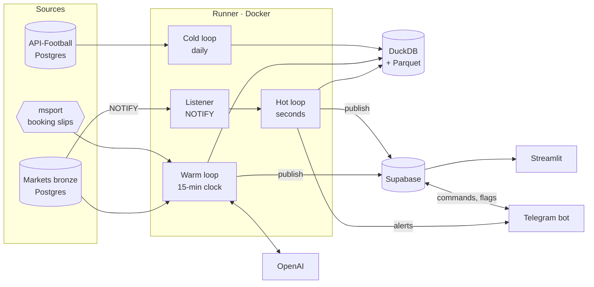
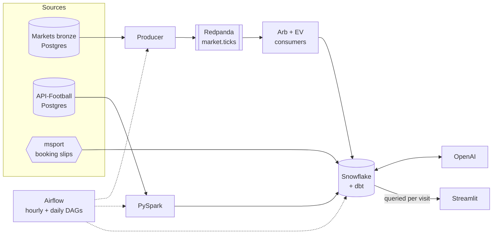

# arbibet-capstone

Cross-bookmaker market signals for football: arbitrage, positive expected value
and booking-slip analysis across five bookmakers, served on a public dashboard.

Built as the capstone for the Ironhack Data Engineering bootcamp (Jul–Sep 2026).
Dashboard: <https://arbibet.streamlit.app>

> Sports data and market signal, not betting infrastructure. Bookmaker prices
> are the highest-frequency signal in the domain; the outputs are about market
> efficiency and insight. This is a reference implementation.

## What it does

- **Normalises five bookmakers onto one market taxonomy.** Three publish
  betradar identifiers; bet9ja and livescorebet use proprietary schemes. A
  236-row crosswalk makes cross-book comparison possible.
- **Detects surebets and positive EV within seconds** of a bookmaker publishing
  a new price, refusing stale legs, suspended markets and in-play fixtures.
- **Settles history.** Match statistics and 6.2M settled team markets from
  API-Football give each slip leg and fixture a measured base rate.
- **Explains.** `gpt-4o-mini` writes pre-match briefs, slip verdicts and
  post-match notes from warehouse data only, shown beside the numbers they cite.
- **Alerts on Telegram, sized to your money.** A bot messages subscribers the
  moment a surebet or positive-EV price appears, with stakes sized to their
  balances at each book, and keeps a wallet of placed bets, real and paper,
  settled from the same results the platform settles everything with.
- **Shows its track record first.** A paper wallet placed on every signal,
  compounding, beside how the most-copied booking slips actually did.
- **Observes itself.** Every job and component is recorded and shown on a
  Pipeline health page.

## Architecture

### Current (from 17 September 2026)



### Previous (to 17 September 2026)



### Why it changed

| | Previous | Current |
|---|---|---|
| Warehouse | Snowflake | DuckDB, local file (79 MB + 4 MB Parquet) |
| Orchestration | Airflow, hourly | One runner process, event-driven |
| Signal latency | Up to an hour | Seconds, on Postgres NOTIFY |
| Dashboard data | Queried from Snowflake per visit | Documents published to Supabase |
| Observability | Airflow UI | `ops` tables and a Pipeline health page |
| Running cost | $212 of trial credit in 16 days | $0 infrastructure |

The data (221 MB) never needed a cloud warehouse; the cost was compute kept
awake by frequent small jobs and a polling dashboard. DuckDB runs the same dbt
models locally, verified by identical gold row counts after migration.
Snowflake is retained as a record; its code is tagged `snowflake-final`.

## How the pipeline runs

The runner (`runner/main.py`) is a single process, because DuckDB allows one
writer. Every job, including dbt and Spark, runs inside it.

| Loop | Trigger | Work |
|---|---|---|
| Hot | NOTIFY from bronze; 15 s poll fallback | Recompute arbitrage and EV for the changed fixture, store, alert, publish |
| Warm | :00, :15, :30, :45 (an overrun starts the next at once) | Dimensions, slips, price history, arbitrage tracking, live state, dbt, AI summaries, publish |
| Cold | Daily 06:00 Berlin | Spark flatten and settle, dbt build and tests, slip compaction, backup, pruning |

Writes are MERGEs on natural keys, so any job can be re-run. Failed jobs are
recorded and retried on the next cycle.

**Match verification.** The matcher upstream occasionally files two fixtures
under one event id, which makes two unrelated prices look like a surebet.
Each book's payload is checked against the fixture's teams by name
(`src/arbibet_capstone/verify.py`; optionally gpt-4o-mini for names that only
partly agree, confirmed by gpt-4o). A book that seems to price a different
match becomes a **candidate** in `core.fixture_check` and on the local review
dashboard; nothing is excluded until a person decides there. A confirmed
exclusion applies everywhere (hot loop, price history, tracking, dbt, publish,
Telegram) and removes the book's signals for that fixture.

## Local dashboard

```bash
python -m streamlit run dashboard/local.py
```

Runs on the pipeline machine, reading `data/local/` (bind-mounted from the
runner): pipeline health from `status.json`, and the match-review queue from
`fixture_checks.json`. Decisions are written to `decisions.json`, which the
runner applies within a minute. Warm jobs yield to the hot loop while
it recomputes, and the runner reaches the source databases over their Docker
networks rather than `host.docker.internal` (35× faster for bronze payloads).

## Telegram bot

Two threads inside the runner (`runner/telegram/`). Alerts are handed over
in-process by the hot loop, so they leave seconds after a price; commands read
the same Supabase documents as the dashboard and never touch DuckDB.

- **Alerts:** a true surebet (arbitrage above 1, legs within five minutes), or
  EV at or above the subscriber's threshold (default 0.015), before kick-off
  and never on a flagged leg. Each shows legs, links and a stake split. Sent
  once per market or outcome, and again only if the value improves by 0.005
  (surebet) or 0.02 (EV).
- **Wallet:** `/balance msport 50000` records cash at a book; alerts are then
  sized to it (the largest split every leg's balance allows, the binding book
  named). **Placed** records the bet and moves the stakes; `/placed 4700 5000`
  corrects them; **Odds changed** re-splits at the site's prices; **Paper**
  does the same in a practice wallet that starts at ₦100,000 per book.
  `/wallet` shows equity, locked-in profit on open surebets and settled P&L.
  Bets settle in the warm loop from `fact_team_market_result`, leg by leg.
- **Access:** anyone may read; sizing, the wallet and Placed need a balance
  set; the owner (`TELEGRAM_OWNER_CHAT`) has `/admin`. Deep dives show a
  screen and link the rest to the dashboard.
- **Commands:** `/surebets`, `/ev 0.02`, `/stake 100 2.10 1.95`, `/slips`,
  `/dive <search>`, `/flags`, `/health`, `/settings`, `/start`, `/stop`.
- **State:** `bot.subscriber`, `bot.alert`, `bot.balance`, `bot.bet` and
  `bot.report` in Supabase, with row-level security and no dashboard access.
  Flags go to `serving.leg_flag`, shared with the dashboard.

Create a bot with @BotFather and set `TELEGRAM_BOT_TOKEN` in `.env`; the bot
is off without it. `TELEGRAM_ALLOWED_CHATS` optionally restricts who may use it.

## Operations

```bash
docker compose up -d --build runner              # start; restarts with Docker
docker compose logs -f runner                    # logs
docker exec arbibet-runner python -m runner.status
```

- `ops.job_run` records every execution: duration, rows, errors, and hot-loop
  latency from payload to stored signal.
- `ops.heartbeat` holds the last beat per component, including `telegram`.
- Both are mirrored to Supabase every minute and shown on the Pipeline health
  page, with a Telegram section (subscribers, alerts, lag, errors).

The warehouse lives in the `arbibet-warehouse` Docker volume. In Supabase, the
tables are in the `serving` and `ops` schemas with row-level security; the
dashboard uses a read-only role (`sql/supabase_dashboard_role.sql`).

## Setup

```bash
cp .env.example .env        # source DSNs, OPENAI_KEY, SUPABASE_DB_URL, TELEGRAM_BOT_TOKEN
py -3.12 -m venv .venv
.venv/Scripts/python.exe -m pip install -e ".[dev,spark]" duckdb dbt-duckdb
pytest
python scripts/install_bronze_notify.py
docker compose up -d --build runner
```

Streamlit secrets: `SUPABASE_HOST`, `SUPABASE_PORT`, `SUPABASE_USER` and
`SUPABASE_PASSWORD` for the `dashboard_reader` role.

## Repository

| Path | Contents |
|---|---|
| `dashboard/views/record.py` | Track record: the paper wallet and how copied slips fared |
| `runner/` | Listener, loops, Supabase publisher, Telegram bot, observability, Docker image |
| `src/arbibet_capstone/` | Bronze reader, crosswalk and parsers (vendored), signals, warehouse layer |
| `dbt/` | Staging and gold models with tests |
| `spark/` | Match-history flatten and market settlement |
| `odds/`, `slips/`, `enrich/` | Price history, slip ingestion, AI summaries |
| `publish/snapshot.py` | Builds the published documents |
| `dashboard/` | Streamlit app |
| `sql/` | DuckDB schema, NOTIFY trigger, Supabase role |
| `snowflake/`, `airflow/`, `producer/`, `consumers/` | Previous architecture, kept for reference |
| `web/` | Next.js front end over the same documents; not deployed |
| `docs/FINDINGS.md` | Investigation log |

## Findings

- **True surebets are rare.** Early runs flagged 174 opportunities up to 7.83×;
  all were crosswalk defects. After fixes and a five-minute leg-freshness rule,
  35 true surebets remain, mostly in obscure markets.
- **Stale legs create false arbitrage.** Bronze stores a price only when it
  changes, so legs can be hours apart. All 48 implausible signals had legs more
  than five minutes apart; the detector now refuses them.
- **Popularity does not track soundness.** A slip copied 5,739 times had a
  1-in-411,956 chance; the most-copied slip on the same fetch was 1-in-13.

## Limitations

- Historical rates cover at most ten matches and ignore opponent strength.
- EV for books without a published probability uses a borrowed one.
- Slip legs vanish at kick-off, so a stored slip is its remaining, bettable part.
- xG exists for a minority of leagues.
- Freshness depends on the pipeline machine being on; otherwise the dashboard
  shows the last published data.

## Credits and cost

The bronze collectors, fixture matcher, bookmaker parsers, crosswalk, arbitrage
engine and settlement engine predate this project and are vendored; everything
around them is this repository. Infrastructure runs on free tiers (DuckDB,
Supabase, Streamlit). OpenAI usage was about $1 to mid-September 2026.
