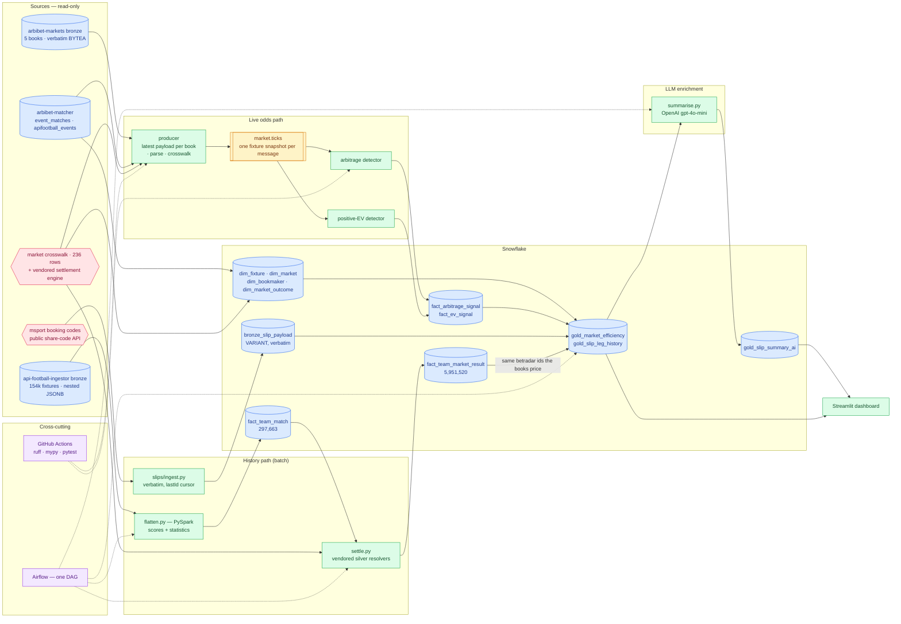

# arbibet-capstone

**Sports Information Platform — a minimum-viable data engineering reference implementation.**

Reads the append-only bronze layer of an existing multi-bookmaker collection
platform, normalises five bookmakers' incompatible market schemes into a single
canonical market/outcome taxonomy, publishes canonical per-fixture price
snapshots to Kafka, fans out to per-signal consumers writing Snowflake facts,
transforms with PySpark and dbt into a gold layer, enriches it with
LLM-generated match summaries through an orchestrated Airflow task, and serves a
Streamlit dashboard.

Built as the capstone for the Ironhack Data Engineering bootcamp (Jul-Sep 2026),
in a 2.5-day focused sprint. Full plan: [`docs/capstone-plan.md`](docs/capstone-plan.md).

> **Data framing.** Sports data and market signal, not betting infrastructure.
> Bookmaker prices are used as the highest-frequency signal source available in
> the domain; the analytical outputs are about market efficiency, per-source
> drift, and insight generation. This is a reference implementation, not a
> production consumer service.

---

## Architecture



**Reading key:** solid arrows = data flow; dashed = cross-cutting concerns.
Yellow = Kafka topic; blue = data stores; green = processors; pink = reference
data; purple = orchestration and CI.

### The problem this platform actually solves

Three of the five bookmakers publish market and outcome identifiers from the
betradar taxonomy natively. Two -- bet9ja and livescorebet -- publish
proprietary schemes: bet9ja keys markets as strings like `S_OU@2.5`,
livescorebet as integer `type` codes. Until those are reconciled no
cross-bookmaker comparison is possible at all, because "Over 2.5 goals" is a
different string at every book.

A 236-row crosswalk maps both dialects onto the betradar space. Everything
downstream -- arbitrage detection, positive-EV screening, the gold aggregates --
is only meaningful because that reconciliation happened first.

---

## Repository layout

| Path | What it is |
|---|---|
| `src/arbibet_capstone/bronze.py` | Reads the latest payload per bookmaker for one fixture |
| `src/arbibet_capstone/crosswalk/` | **Vendored** parsers, arbitrage engine, and the crosswalk CSV |
| `producer/` | Bronze to parse to canonical snapshot to Kafka |
| `consumers/` | `arb.py` and `ev.py`, one signal each, both writing Snowflake facts |
| `spark/` | PySpark dimension refresh |
| `dbt/` | Staging and gold models, plus the tests that enforce the schema |
| `slips/ingest.py` | Fetches msport booking codes, stored verbatim |
| `spark/flatten.py` | Flattens the ingestor's nested match payloads into `fact_team_match` |
| `spark/settle.py` | Settles historical markets per team via the vendored silver resolvers |
| `enrich/summarise.py` | LLM verdict per slip, grounded in `gold_slip_leg_history` |
| `dbt/` | Staging, `gold_market_efficiency`, `gold_slip_leg_history`, 28 tests |
| `airflow/dags/` | One DAG: dims -> dbt run -> dbt test -> summaries |
| `dashboard/` | Streamlit app |
| `snowflake/ddl.sql` | Warehouse schema |
| `scripts/go_no_go.py` | The gate that proves cross-book resolution works |

---

## Quickstart

```bash
cp .env.example .env          # then fill in the DSNs, Snowflake and OPENAI_KEY
py -3.12 -m venv .venv        # 3.12: pyspark 4 needs it, 3.14 has no wheels yet
.venv/Scripts/python.exe -m pip install -e ".[dev,spark]"
pytest                        # 51 tests, no database required
```

Then, in order:

```bash
python snowflake/apply_ddl.py          # schema
python snowflake/load_dims.py          # dimensions, incl. the betradar maps
docker compose up -d redpanda          # broker
python producer/main.py 2 5            # bronze -> market.ticks
python consumers/arb.py                # -> fact_arbitrage_signal
python consumers/ev.py                 # -> fact_ev_signal
cd dbt && dbt run --profiles-dir . && dbt test --profiles-dir .
python enrich/summarise.py             # -> gold_slip_summary_ai
```

Signals reach the warehouse two ways. The batch path above (and the daily DAG)
is the completeness path. For freshness, a long-running **watcher** recomputes
arbitrage and EV the moment new prices land for an upcoming fixture and pushes
any opportunity straight to Snowflake — the way the legacy platform worked:

```bash
python watch/signals.py                # continuous; pre-kickoff fixtures only
```

Both write on `signal_key`, so they converge rather than duplicate. The watcher
touches Snowflake only when there is a signal to write, polls markets bronze by
its indexed key, and ignores in-play matches — see FINDINGS 8d.

The history jobs run in the Airflow image rather than on the host, because
`spark.jars.packages` needs a Hadoop temp dir that Windows cannot provide
without `winutils.exe`:

```bash
docker run --rm --env-file .env \
  -e JAVA_HOME=/usr/lib/jvm/java-17-openjdk-amd64 \
  -e PYSPARK_PYTHON=/home/airflow/venv/bin/python \
  -e PYTHONPATH=/opt/project/src \
  -v "$PWD:/opt/project" -w /opt/project \
  --entrypoint /bin/bash arbibet-capstone-airflow:2.10.3 \
  -c '$PIPELINE_PYTHON spark/flatten.py'
```

`JAVA_HOME` and `PYSPARK_PYTHON` must be overridden: `.env` holds host values,
and passing them into a Linux container stops the JVM from starting at all.

## The dashboard

Live against Snowflake, two pages. Regenerate the images with
`python docs/capture_screenshots.py` while the app is running -- they are
scripted rather than hand-captured because every number on the page moves, so a
hand-framed screenshot silently ages while the README goes on citing it.


Headline counts, then cross-book overround by market. The one negative bar is
first-half corners: the obscure market where soft books pay least attention,
and where both of the best surebets were found. Only TRUE surebets are counted
-- the consumer records near misses down to 0.98 so market efficiency can be
measured, but a headline counting them would read as 25 opportunities when
there were four.


One card per signal rather than one row per leg: arbitrage, spread and
detection time are properties of the SET, and repeating them on every leg
invited reading four legs as four opportunities. **Spread** is the gap between
the oldest and newest price in the set -- how far from simultaneous the
snapshot was. Nothing is filtered on it, wide ones included, because hiding
them would flatter the result.

Outcome names come from the bookmakers themselves. The settlement taxonomy
names outcomes only for markets the engine can settle, and it settles from
scores, so corners arrive with ids and no names -- this table used to read
`outcome 12`. Resolving the id alone would be a confident lie: id 12 means
`over` in one market and `1-2` in another.


How the price got to where the signal caught it: every price change all five
books published for one outcome, replayed from bronze through the same
crosswalk that produced the signal. Step interpolation, because a price holds
until the book moves it; Plotly, because the series run to hundreds of points
over days and the interesting parts are minutes wide. The dashed line is
kick-off.


The five fixtures the most booking slips were built on, each with its own page.
Ranked by how many DISTINCT slips name the fixture -- one hugely-copied slip
should not make its fixtures look widely backed.


The LLM panel, with the model's input beside its output -- deliberately, so a
reader can judge the verdict rather than take it. That pairing is a correctness
feature: it is what caught a stale summary describing evidence that had since
gone to NULL.

### A fixture deep dive

Five fixtures, one page each, reached by link.


A prose brief written by `gpt-4o-mini` from **this warehouse and nothing else**:
the price series in `fact_odds_tick`, the match history in `fact_team_match`,
the settled market rates in `fact_team_market_result`. A football fixture is
exactly the sort of subject a language model already has opinions about, so the
system prompt forbids outside knowledge in those terms -- no league position,
no injuries, no past meetings -- and the user prompt carries every number the
answer is allowed to contain. It is asked to keep prices and results apart
rather than average them into a verdict, because the gap between them is the
only interesting thing on the page.


Every book's price for every outcome of one market, faceted so the whole market
is legible at once rather than overlaid on a single axis. The dashed line is
kick-off, in Europe/Berlin -- which is not a detail: Snowflake's session
timezone defaults to `America/Los_Angeles`, and until it was pinned this
evening fixture displayed an 11:45 kick-off. No instant was ever stored wrong;
every wall clock printed nine hours early. See FINDINGS 6b.


And what both sides had actually been doing beforehand, from API-Football, plus
how the same betradar markets have really settled for them. Only matches BEFORE
kick-off count: using a side's later results to judge how a fixture was priced
is the most inviting mistake on the page.

## What the pipeline found

**Arbitrage is approximately zero, and that is the answer.** The first run
flagged 174 opportunities, the worst at 7.83x -- betting every outcome for 783%
of stake. Every single one was a crosswalk defect: an over/under ladder
collapsed into one market, an asian handicap not normalised to the home frame,
a suspended market read as a live price. After three parser fixes: **25 signals,
4 of them true surebets, the best at 1.0396** -- and both of the best sit on
first-half corners, the obscure market where soft books pay least attention.

**Popularity and soundness are uncorrelated.** 5,739 people copied a slip with
a 1-in-411,956 chance of winning. The most-followed slip on the same fetch was
a sane 1-in-13. That is what makes "does this slip make sense?" a real question
rather than a gimmick.

**Legs are not simultaneous.** Bronze writes only when a payload changes, so a
book whose price has not moved contributes a stale leg. Observed spreads reach
108,927 seconds -- 30 hours. Every arbitrage row carries the spread, and the
gold model reports overround twice, whole and fresh-only, so the cost of stale
legs is visible rather than filtered away.

## Honesty statement

**What a row in `fact_arbitrage_signal` means.** `ARB_RECORD_THRESHOLD` is
0.98, so the table records **near-arbitrage** -- the shortfall left after
shopping every book -- not only guaranteed returns. `arbitrage > 1` marks a
true surebet; everything below is cross-book disagreement, which is the thing
worth measuring given surebets barely exist. Reading the row count as an
opportunity count would overstate the platform by roughly six to one.

**What was reused, not built.** The bronze collection layer, the cross-book
fixture matcher, the five bookmaker parsers, the 236-row market crosswalk, the
arbitrage/EV engine, and arbibet-silver's 4,874-line settlement engine all
predate this capstone and belong to the wider Arbibet platform. This repository
is the pipeline *around* them.

**What is new here.** The bronze-to-Kafka producer, both consumers, the
warehouse schema, the Spark flatten and settle jobs, the slip ingest, every dbt
model, the LLM summariser, CI, the Airflow DAG and the dashboard.

**Authorship.** Architecture, specification and verification are the author's;
much of the implementation was produced through a spec-driven
coordinator-implementor-verifier workflow with AI implementors.

**What the numbers do not say.** `historical_rate` is a base rate over at most
ten matches and knows nothing about opponent strength -- Osnabruck have won 5
of 10 and are 38.89 to beat Bayern Munich. It is recent form, never a
probability for the fixture in hand. Slip probabilities multiply msport's own
per-leg numbers, which embeds their margin and assumes the legs are
independent; two legs on the same match are not. And `bettableBetSlip` is the
**remnant** of a slip, not the original -- legs vanish at kickoff -- so the
metric is copyability now, not whether the slip was ever sound.

**Coverage.** Only 24,672 of 297,663 team-match rows carry xG, because
API-Football populates statistics for some leagues and not others. 91% of slip
legs resolve to a fixture; 88% reach a settled history.

**Scope deferred.** AWS, IaC, Iceberg, NiFi, Spark Structured Streaming and
Great Expectations are absent by decision. See the roadmap.

## Cost report

| Component | Cost |
|---|---|
| Snowflake | $0 -- 30-day trial credit |
| Redpanda, Spark, Airflow, Postgres | $0 -- local containers |
| Streamlit Community Cloud | $0 |
| OpenAI `gpt-4o-mini` | **~$0.20** |
| **Total** | **~$0.20** |

Snowflake Cortex was the original plan for the AI layer and would have been
$0. Cortex AI functions are unavailable on trial accounts -- verified in the
console, both `COMPLETE` and `SENTIMENT` refuse on account type, and neither a
different model nor cross-region inference helps. The summariser moved to an
orchestrated task calling OpenAI, which costs about twenty cents and, as a
side effect, put the LLM behind a swappable boundary: replacing it with a
locally-hosted model is now a one-file change.

## Post-capstone roadmap

Deferred by design, in the order they would be picked up. Each closes a distinct
gap.

1. **NiFi normalisation flow** -- move parse and crosswalk out of the producer
   into a NiFi stage between a raw and a canonical topic.
2. **AWS Lambda + S3 + Terraform** -- the api-football fetch as a scheduled
   container Lambda landing raw JSON in S3, all provisioned as IaC.
3. **Iceberg bronze on S3** -- register that S3 output as an Iceberg table via
   the Glue Catalog.
4. **Great Expectations** -- silver and gold suites wired into the DAG.
5. **Spark Structured Streaming freshness monitor** -- a third consumer doing
   stateful windowed per-book freshness.
6. **Extend the crosswalk past five books** -- bronze already collects fourteen.
   Each addition is one parser plus its crosswalk rows, and widens the price
   spread that arbitrage depends on.
7. **Swap OpenAI for a locally-hosted model** -- the summariser is already a
   task, so this is a one-file change. That is the argument for having put the
   LLM behind a task rather than inside a SQL function.

---

## Two rules this codebase enforces

**Never filter bronze by `bookmaker` alone.** The indexes on
`bronze_event_payloads` are `(event_id, bookmaker, write_time DESC)`,
`(fire_time)` and `(event_id, bookmaker, payload_sha256)` -- none leads with
`bookmaker`, so a book-only filter degrades to a sequential scan over the BYTEA
payload bodies. That query took the production host down once.

**Bronze's bookmaker spelling is canonical.** `msport`, not `msports`;
`ilotbet`, not `ilobet`. The matcher uses the other spellings and
arbibet-markets translates them once on the way in, so everything downstream of
bronze -- this repository included -- uses bronze's vocabulary and never
introduces a second one.

---

## Development

```bash
pip install -e ".[dev]"
pytest          # no database required
ruff check .
mypy
```

`src/arbibet_capstone/crosswalk/` is vendored from the Arbibet platform and is
excluded from `ruff` and `mypy --strict`. Typing it would mean rewriting it, and
not rewriting it is the point of vendoring. Everything this repository authors
stays under strict.

Upstream databases are read-only: `bronze.connect()` sets
`default_transaction_read_only` on the session, so a stray write is refused by
Postgres rather than caught in review.

### Match history and market resolution

The LLM summaries are grounded in two things, both derived from
`api-football-ingestor`'s `bronze_fixture_details` (154,088 nested payloads,
829 leagues, current to today):

**Statistical form** -- `fact_team_match`, one row per (fixture, team). Carries
the four score containers API-Football publishes, the period components those
resolve into, and the full statistics block: xG, possession, shots by type,
passes, cards, corners, saves. How a side has been playing, not only what it
scored.

**Market resolution** -- `fact_team_market_result`, one row per team per
settled market. The same betradar market families the bookmakers are pricing
right now, settled against historical results. That is what lets a summary say
"these sides have gone over 2.5 in seven of their last ten" rather than "they
have won three of five".

The settlement engine is arbibet-silver's, vendored whole: `settlement.py`,
`team_perspective.py` and the two betradar maps. They are pure functions with
no I/O -- silver enforces that with an AST test -- so they port without
modification. Two of their decisions are load-bearing here:

- **Period-resolved scores.** A market declares what it settles on; 1st-half
  markets settle on `h1`, and knockouts settle differently on regular versus
  full time. Silver measured an AET final where 3 of 6 markets settled
  differently on the two bases, which is why one collapsed score is not enough.
- **Refusal over default.** A market family the engine has not classified is
  refused with a reason, never silently treated as symmetric. Unsettleable rows
  are kept -- they are the map's to-do list, not noise.

Two column names look odd and are deliberate, per silver's D16:
`goals_prevented_fixture` is fixture-level because API-Football reports it
identically for both teams, and `passes_accurate` is a count, not a percentage.

Not extracted yet: `events`, `lineups` and `players`. Those are the first
post-capstone job.

### Spark

`spark/dim_refresh.py` runs PySpark in **local mode** -- there is no cluster.
For a 236-row dimension load a standalone master and worker would be ceremony,
and local mode still exposes the Spark UI on `:4040` while a job runs.

Three environment facts it depends on, all set in `.env`:

| Requirement | Why |
|---|---|
| **PySpark 4.x**, not 3.5 | PySpark 3.5's classifiers stop at Python 3.11; on 3.12 the worker crashes with `Python worker exited unexpectedly` |
| **JDK 17** on `JAVA_HOME` | Spark needs Java 17 or 21. Java 18+ breaks `Utils.getCurrentUserName`, and Java 24 removed the Security Manager the common workaround relied on |
| **`PYSPARK_PYTHON`** = the venv interpreter | Otherwise Spark launches bare `python` from PATH and the worker dies with a socket reset |

The `winutils.exe` / `HADOOP_HOME` warning on Windows is benign for JDBC work
and can be ignored.
