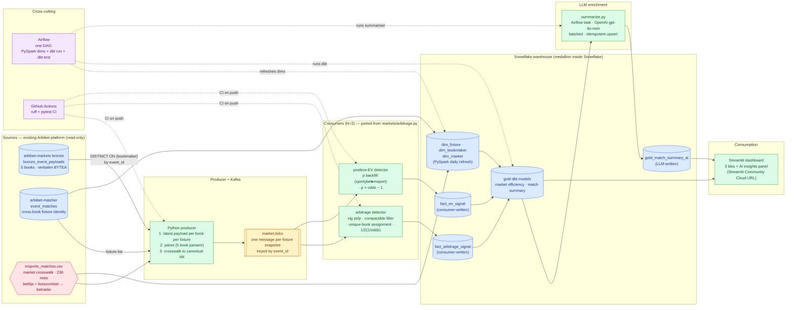

# DE Capstone Plan — Simple Mode (Ironhack, 2.5 days including presentation)

**Status:** planning · **Owner:** Anthony · **Target start:** post-Ironhack curriculum end · **Target ship:** **2.5 calendar days of full-time focused work at ~8h/day (20h total, of which ~3h is presentation prep)** · **Hard cap:** Ironhack capstone presentation deadline · **Health rule:** sleep 7-8h/night. Day 0 prep is what makes 2.5 days feasible; skip it and you'll ship v0.5.

**Revision 2026-09-01:** source changed from `arbibet-live` to **`arbibet-markets` bronze** (all five books, months of history, the layer the arb engine was written against). The market crosswalk CSV was located and does **not** need rebuilding, so the arb/EV consumers are a port rather than a build — this is what makes the five-book scope affordable inside 2.5 days.

**Revision 2026-09-01 (b):** **Snowflake Cortex is unavailable on trial accounts** — verified in the console, both `CORTEX.COMPLETE` and `CORTEX.SENTIMENT` refuse with "not available for trial accounts". Neither a different model nor cross-region inference helps; the block is on account type. The AI layer moves to **OpenAI `gpt-4o-mini` in an orchestrated Airflow task**, which is a closer fit to the JD phrase "applying AI in a data context" than a SQL function call anyway. Cost report goes from $0 to ~$0.20.

<!-- USER LAYER. Sibling to `data/de-capstone-plan.md` (hybrid AWS ~€25-45/30d)
     and `data/de-capstone-plan-zerocost.md` (LocalStack $0/30d).
     This one is the aggressive-scope-cut version: no AWS, no NiFi, no Iceberg,
     no Databricks, no Spark Streaming, no Great Expectations, no Prometheus.
     Just Kafka + local Spark + Airflow + dbt + Snowflake + OpenAI + Streamlit,
     shipped in 2.5 days. Same architecture DNA, minimum-viable execution.
     -->

## Why a third plan file

Two earlier plans (`de-capstone-plan.md` hybrid AWS, `de-capstone-plan-zerocost.md` LocalStack) assumed 5 days at ~10h/day. **User has only 2.5 days total (including presentation)**. That is not a "cut a few features" adjustment — it's a "cut most features" adjustment. Simple mode ships the minimum viable Ironhack-curriculum-covering DE pipeline in 20 hours. Everything cut moves to Post-capstone roadmap, not lost.

**What's cut vs the max-mode plan:**
- AWS entirely (no S3, Lambda, Kinesis, Firehose, Glue, IAM, CloudWatch)
- Terraform / IaC (nothing to provision)
- LocalStack + MinIO (nothing to emulate)
- NiFi (user-requested cut — enrichment moves inline into the producer)
- Iceberg (Snowflake native tables handle bronze/silver/gold — the "medallion inside a warehouse" pattern)
- Databricks Free Edition (was supplementary; skip for time)
- Spark Structured Streaming (freshness monitor cut entirely; fan-out at N=2)
- Great Expectations (dbt built-in tests cover data hygiene)
- Prometheus + Alertmanager custom rules (Airflow's own failure notifications suffice)
- Cost observability layer (no cloud spend to observe)
- Cold-tier Iceberg archival (needed AWS Glacier)
- Third consumer (freshness monitor)

**What's kept:**
- Python, Kafka + 2 consumers, local Spark, Airflow, dbt, Snowflake, **an LLM enrichment task** (OpenAI `gpt-4o-mini`, orchestrated by Airflow), Streamlit deployed URL, GitHub Actions CI, SQL (Postgres + Snowflake).

That's **10 tool keywords** — the full Ironhack curriculum minus NiFi and cloud, plus an orchestrated LLM enrichment step as a legit differentiator for about 20 cents.

**What's reused, not built (this is why Day 1 fits in 8h):**
- **Source data** — `arbibet-markets` bronze (`bronze_event_payloads`), already collecting all five books verbatim as BYTEA. The capstone *reads* it; it does not collect. (Changed from `arbibet-live`: markets bronze covers all five books, has months of history, and is the layer the arb engine was written against.)
- **Fixture identity** — `arbibet-matcher`'s `event_matches`, already resolving the same fixture across books. This replaces the missing `last_matches.csv`.
- **Market crosswalk** — `assets/msports_matches.csv` (236 rows), the `marketId → bet9ja / livescorebet` lookup that puts all five books in one betradar market/outcome id space. **Recovered — does not need rebuilding.**
- **Parsers + arb/EV engine** — `markets/parsers/` (all five books) and `markets/arbitrage.py` (vig strip, compactible filter, surebet math, unique-bookmaker assignment, EV). The consumers **port** this; they do not invent it.

Genuinely new in the capstone: the bronze→Kafka producer, two consumer wrappers, the Snowflake schema, dbt models, the LLM summariser task, the Airflow DAG, CI, and the dashboard.

## Framing (header of the capstone's own README verbatim)

> **Sports Information Platform — minimum-viable data engineering reference implementation.**
>
> A data platform for sports data aggregation. Reads the append-only bronze layer of an existing multi-bookmaker collection platform, **normalises five bookmakers' incompatible market schemes into a single canonical market/outcome taxonomy** via a maintained crosswalk, publishes canonical per-fixture price snapshots to a Kafka topic, fans out to per-signal Python consumers writing to Snowflake fact tables, transforms with PySpark and dbt into a Snowflake gold layer, enriches it with LLM-generated match summaries through an orchestrated Airflow task, orchestrates with Airflow, and serves via a Streamlit dashboard deployed to Streamlit Community Cloud. Built in a 2.5-day focused sprint as the capstone for the Ironhack Data Engineering bootcamp (Jul-Sep 2026); post-capstone roadmap in this repo lists the deferred extensions (AWS, IaC, Iceberg lakehouse, NiFi routing, Spark Streaming, ML predictors).
>
> The cross-bookmaker normalisation is the platform's real contribution: three books publish betradar ids natively, two publish proprietary schemes, and reconciling them is what makes any cross-book comparison possible at all.
>
> Data framing: sports data + market signal, not betting infrastructure. Market prices from bookmakers are used as the highest-frequency signal source; analytical outputs focus on market efficiency, per-source drift, and consumer-facing insight generation. Reference implementation, not a production consumer service.

## Prerequisites (do BEFORE Day 1)

### Instructor confirmations — DONE
- [x] Ironhack: capstone can extend existing personal project ✓
- [x] Ironhack: Streamlit accepted as BI-tool substitute ✓

### Cloud + accounts (all free)
- [ ] Snowflake trial signup: 30-day trial with $400 credit. Warehouse auto-suspend set to 5 min. **Do not plan on Cortex** — AI functions are blocked on trial accounts (confirmed 2026-09-01).
- [ ] OpenAI API key available (the same account `arbibet-matcher` already uses for embeddings). Billing has a balance.
- [ ] Streamlit Community Cloud account linked to GitHub, one hello-world app deployed and reachable.
- [ ] GitHub repo `arbibet-capstone` created with `.github/workflows/` skeleton pushed.

### Day 0 (evening or half-day before Day 1, **3-4h**)
The single biggest lever for a 2.5-day sprint. Skip this and you ship v0.5.

**Environment (1.5h):**
- [ ] Docker + docker-compose working. **Pull all needed images once**: `redpandadata/redpanda:latest`, `bitnami/spark:latest`, `apache/airflow:latest`, `postgres:16`. Then `docker compose up -d` verifies they all boot.
- [ ] Python 3.11+ with `pip install confluent-kafka snowflake-connector-python dbt-core dbt-snowflake pyspark streamlit`. Verify each import works.
- [ ] Snowflake trial live; `SELECT current_version()` returns and `COMPUTE_WH` resumes on demand.
- [ ] `OPENAI_KEY` in `.env`; a one-line `gpt-4o-mini` chat call returns text.

**Skeletons pre-drafted (1.5h — this is what makes 2.5 days feasible):**
- [ ] Repo skeleton: `producer/`, `consumers/` (with `arb.py` and `ev.py` stubs), `crosswalk/` (vendored parsers + `arbitrage.py` + the CSV), `spark/dim_refresh.py`, `dbt/` (project structure), `dashboard/app.py`, `airflow/dags/`, `docker-compose.yml`, `.github/workflows/ci.yml`, `README.md` skeleton with all sections + mermaid diagram already embedded.
- [ ] Snowflake DDL script for `fact_arbitrage_signal`, `fact_ev_signal`, `dim_bookmaker`, `dim_fixture`, `dim_market` — ready to `snowflake.execute()` on Day 1.

**Port prep (1h — the new critical path; do NOT skip):**
- [ ] Copy `msports_matches.csv` from the archive into `assets/msports_matches.csv`. Confirm `config.load_market_mappings()` reads it and `livescorebet` casts to `Int64` without error.
- [ ] **Fix the `msport` / `msports` name mismatch.** Bronze writes `msport`; `parsers/__init__.py` `PARSER_REGISTRY` and `arbitrage.fill_probabilities` both key on `msports`. Unfixed: msport payloads get no parser *and* EV silently loses half its probability source. One rename at the bronze boundary.
- [ ] Stop `parse_bookmaker` swallowing exceptions into `[]` ([parsers/__init__.py:47]) — during the port a missing CSV and a genuinely empty market must not look identical.
- [ ] Vendor `markets/parsers/` + `markets/arbitrage.py` + `models.py` into `crosswalk/`, imports fixed, `pytest` collects.

**Sanity + head-loading (30 min):**
- [ ] Pull one `event_id` from markets bronze that has payloads from **all five books**, run it through parse → `compute_arbitrage`, and confirm ≥1 canonical `marketId` appears for ≥2 books including one of bet9ja/livescorebet. **This is the go/no-go check.** Fix Day 0, not Day 1.
- [ ] Calendar blocked. Notifications off. Someone knows you're on a 2.5-day sprint.

## Architecture at a glance

Renders on GitHub natively, imports into <https://mermaid.live/> and Excalidraw directly.

**Reading key:** solid arrows = data flow; dashed = cross-cutting concerns. Yellow = Kafka topic; blue = data stores (upstream Postgres + Snowflake); green = processors; pink = reference data; purple = orchestration + CI.

**The one message shape that matters:** a `market.ticks` message is *one fixture at one moment, all five books, already in one market/outcome id space*. Arbitrage needs every book for a fixture simultaneously, so the fixture snapshot — not the individual price — is the unit. That framing is also what makes the crosswalk visible in the demo: browse one message and every book speaks the same ids.

## Day-by-day (2.5 days, ~8h/day)

### Day 1 (8h) — Ingestion path + processing + gold layer
- **Block 1 (4h) — Kafka path**
  - Redpanda docker-compose up + topic created (0.5h)
  - Python producer: fixture list from `event_matches`; per fixture, `DISTINCT ON (bookmaker)` latest payload from markets bronze; `json.loads` the BYTEA; parse all five books; publish the canonical snapshot to `market.ticks` keyed by `event_id` (1.5h)
  - Python arbitrage consumer: subscribes, calls the ported `compute_arbitrage`, writes `fact_arbitrage_signal` in Snowflake (1h)
  - Python EV consumer: same pattern, surfaces the `EV >= 0.01 and p >= 0.5` rows → `fact_ev_signal` (1h)
- **Block 2 (4h) — Warehouse + gold**
  - Local Spark cluster docker up (0.5h)
  - PySpark job: reads `event_matches` + the crosswalk CSV → writes `dim_fixture`, `dim_bookmaker`, `dim_market` to Snowflake (1.5h)
  - dbt Core setup: `dbt_project.yml`, `profiles.yml`, one `stg_` model per fact table (0.5h)
  - `gold_market_efficiency` model — weekly vig aggregate — with dbt tests (`unique`, `not_null`, `relationships`) (1h)
  - `enrich/summarise.py` — reads the gold match rows, calls OpenAI `gpt-4o-mini` per match, upserts `gold_match_summary_ai` (1h)
  - *Note: this block is now 4.5h, not 4h. The LLM task is the named drop lever if the day runs long — see anti-scope-creep.*
- **Ship end of Day 1:** live Kafka topic carrying canonical five-book fixture snapshots + two consumers landing rows in Snowflake facts + PySpark dim refresh working + one gold model + one AI-summary gold model, all queryable in Snowflake console.

### Day 2 (8h) — Orchestration + consumption + docs
- **Block 1 (4h) — Airflow + CI + Streamlit skeleton**
  - Airflow docker-compose up (0.5h)
  - One DAG: PySpark dim refresh → dbt run → dbt test → LLM summariser (with Slack/email notify on failure) (2h)
  - GitHub Actions CI workflow: ruff + pytest across `producer/`, `consumers/`, `spark/` — auto-runs on PR (0.5h)
  - Streamlit `app.py` skeleton with Snowflake connector; verify one tile renders live data (1h)
- **Block 2 (4h) — Streamlit finish + deploy + README**
  - Three tiles + AI insights panel wired to gold tables (2h)
  - Deploy to Streamlit Community Cloud + verify URL renders from a fresh browser (0.5h)
  - README fill-in: architecture (mermaid embed), run instructions, honesty statement, cost report (~$0.20 — OpenAI only), Post-capstone roadmap section (1h)
  - Screenshots for repo (dashboard, dbt lineage, Airflow DAG run) (0.5h)
- **Ship end of Day 2:** end-to-end pipeline running via Airflow + Streamlit URL live + README complete + repo tagged v1.0.

### Day 3 (half day, 4h) — Video + presentation + submit
- **Block 1 (2h)** — Video walkthrough (5 min): mermaid diagram → Kafka topic browse → Snowflake fact-table query → Streamlit URL → LLM-written summary rendered → honesty callout. Record 2-3 takes. Publish unlisted YouTube, embed in README.
- **Block 2 (2h)** — Presentation slides (8-10 slides reusing video structure). Rehearse once. Submit. Present.
- **Ship end of Day 3:** submitted, presented, honest.

**Buffer:** none. If Day 1 slips, drop the PySpark dim refresh entirely (use dbt seeds — CSV loads for dim data — instead; loses "Spark" keyword from Airflow orchestration, keeps it from PySpark being written even if not scheduled).

## Detailed kanban (task-level, atomic)

Each item is a checkbox. Tick as you ship. `[time-estimate]` in brackets. Items with `⚠️` are common blockers worth budgeting extra for.

### Day 0 evening (3-4h prep) — non-negotiable

- [ ] Docker Desktop running · Redpanda + Spark + Airflow + Postgres images pulled `[45m]`
- [ ] `pip install confluent-kafka snowflake-connector-python dbt-core dbt-snowflake pyspark streamlit` in a fresh venv, all imports work `[15m]`
- [ ] Snowflake trial signup + login `[15m]` ⚠️ approval can take up to 1h
- [ ] OpenAI sanity: a one-line `gpt-4o-mini` chat call returns text `[5m]` (Cortex was the original plan — trial accounts block all AI functions, verified 2026-09-01)
- [ ] Snowflake auto-suspend set to 5 min on default warehouse `[5m]`
- [ ] Streamlit Community Cloud account linked to GitHub, hello-world app deployed and reachable `[20m]`
- [ ] GitHub repo `arbibet-capstone` created, skeleton pushed (`README.md`, `docker-compose.yml`, folder stubs) `[30m]`
- [ ] Snowflake DDL script pre-written for `fact_arbitrage_signal`, `fact_ev_signal`, `dim_bookmaker`, `dim_fixture`, `dim_market` `[30m]`
- [ ] README skeleton with all section headings + mermaid diagram embedded `[30m]`
- [ ] Copy `msports_matches.csv` → `assets/`; `load_market_mappings()` returns 236 rows `[10m]`
- [ ] Rename `msport` → `msports` at the bronze boundary (parser registry + `fill_probabilities`) `[10m]` ⚠️ silent EV failure if missed
- [ ] Make `parse_bookmaker` raise instead of returning `[]` on error `[10m]`
- [ ] Vendor `parsers/` + `arbitrage.py` + `models.py` into `crosswalk/`, `pytest` collects `[20m]`
- [ ] **Go/no-go:** one bronze `event_id` with all five books parses, and ≥1 canonical `marketId` appears for ≥2 books including bet9ja or livescorebet `[20m]` ⚠️ if this fails it is specifier formatting — fix now, not Day 1
- [ ] Calendar blocked, notifications off, human check-in scheduled for end of Day 2 `[5m]`

### Day 1 morning (4h) — Kafka path

- [ ] `docker compose up -d` Redpanda; topic `market.ticks` created; `rpk topic list` shows it `[30m]`
- [ ] `producer/bronze_read.py`: fixture list from `event_matches`; per fixture `SELECT DISTINCT ON (bookmaker) bookmaker, payload FROM bronze_event_payloads WHERE event_id = %s ORDER BY bookmaker, write_time DESC` `[45m]` ⚠️ **never filter by `bookmaker` alone** — no bookmaker-leading index exists and it sequentially scans the BYTEA bodies; this is the query that froze the production host
- [ ] `producer/main.py`: `json.loads` the BYTEA, `parse_bookmaker` per book, publish the canonical snapshot to `market.ticks` keyed by `event_id`. Runs 60s, produces >10 messages, ≥1 message carries ≥3 books `[45m]`
- [ ] `consumers/arb.py`: subscribes, calls ported `compute_arbitrage`, writes detections to `fact_arbitrage_signal` in Snowflake `[1h]`
- [ ] `consumers/ev.py`: same shape, surfaces the EV rows `compute_arbitrage` currently only logs → `fact_ev_signal` `[1h]`
- [ ] Both consumers run 60s against the live producer, ≥1 row lands in each Snowflake fact table `[integration checkpoint — 0h if it works, 30m debug budget]`
- [ ] **Sanity gate:** arb rate with all five books is not wildly above the three-betradar-book baseline. A tripling is a crosswalk bug, not profit `[15m]`

### Day 1 afternoon (4h) — Warehouse + gold

- [ ] Local Spark cluster docker-compose up (bitnami/spark: 1 master + 1 worker), Spark UI reachable `[30m]`
- [ ] `spark/dim_refresh.py`: read `event_matches` (fixtures) + the crosswalk CSV (markets), write Snowflake `dim_fixture`, `dim_bookmaker`, `dim_market` `[1.5h]` ⚠️ Snowflake Spark connector jar version matters — pin it. `dim_market` gives the gold layer human-readable market names instead of bare betradar ids
- [ ] `dbt/dbt_project.yml`, `dbt/profiles.yml` pointing at Snowflake trial, `dbt debug` green `[30m]`
- [ ] `dbt/models/staging/stg_arbitrage_signal.sql` + `stg_ev_signal.sql`: light cleanup on top of fact tables `[30m]`
- [ ] `dbt/models/gold/gold_market_efficiency.sql`: weekly vig aggregate from stg_arb + dim_bookmaker `[45m]`
- [ ] `dbt/models/schema.yml`: `unique` + `not_null` + `relationships` tests on both stg and gold models `[15m]`
- [ ] `enrich/summarise.py`: read the gold match rows, call OpenAI `gpt-4o-mini` for a 2-sentence summary per match, upsert into `gold_match_summary_ai`. Idempotent — a re-run skips matches already summarised `[1h]` ⚠️ batch the calls and cap the run; ~20 matches at ~1s each is fine, an unbounded loop over every fixture is not
- [ ] `dbt docs generate` + `dbt docs serve` — screenshot the lineage graph for README `[15m]`

### Day 2 morning (4h) — Airflow + CI + Streamlit skeleton

- [ ] Airflow docker-compose (Astronomer CLI or apache/airflow official compose) up, UI reachable at localhost:8080 `[30m]` ⚠️ Airflow-in-docker gotchas: user permissions on `dags/` volume, `AIRFLOW_UID` env var
- [ ] `airflow/dags/pipeline.py`: DAG with tasks — `spark_dim_refresh` (BashOperator or SparkSubmitOperator) → `dbt_run` (BashOperator running `dbt run`) → `dbt_test` → `ai_summaries` (PythonOperator calling `enrich/summarise.py`). Slack/email failure notification `[2h]`
- [ ] Trigger DAG manually; all four tasks green `[integration checkpoint]`
- [ ] `.github/workflows/ci.yml`: ruff + pytest on push. Verify one green run in Actions tab `[30m]`
- [ ] `dashboard/app.py` skeleton: imports Snowflake connector, connects successfully, one placeholder `st.write("hello")` renders locally `[1h]`

### Day 2 afternoon (4h) — Streamlit finish + deploy + docs

- [ ] Tile 1: line chart of `gold_market_efficiency` weekly vig by source `[45m]`
- [ ] Tile 2: bar chart of daily signal yield (arb count + EV count) `[45m]`
- [ ] Tile 3: table of per-book freshness (last-seen-at from a simple aggregate of fact tables) `[30m]`
- [ ] Panel 4: "AI Insights" — read `gold_match_summary_ai`, render each row as a card with the LLM-written summary + stat strip `[45m]`
- [ ] Deploy to Streamlit Community Cloud (push repo, connect from Streamlit UI, add Snowflake secrets) `[30m]` ⚠️ Streamlit secrets format for Snowflake connector — check docs
- [ ] Verify deployed URL renders live data from a fresh browser session `[15m]`
- [ ] README complete: architecture (mermaid embed), quickstart, honesty statement, cost report (~$0.20 — OpenAI only), Post-capstone roadmap, "what I'd add next" `[45m]`
- [ ] Screenshots: dashboard, dbt lineage graph, Airflow DAG success page, Kafka topic browse `[30m]` — commit to `docs/screenshots/`
- [ ] Repo tagged v1.0 `[5m]`

### Day 3 morning (4h) — Video + presentation + submit

- [ ] Video script written (structure: mermaid → Kafka browse → Snowflake query → Streamlit URL → AI summary shown → honesty callout) `[20m]`
- [ ] Screen-record 2-3 takes of 5-min walkthrough (Loom or OBS) `[1h]`
- [ ] Edit video (trim, add title card) `[30m]`
- [ ] Upload unlisted YouTube; embed in README `[10m]`
- [ ] Presentation slides (8-10 slides reusing video structure) — Google Slides / Keynote `[1h]`
- [ ] Rehearse once end-to-end `[20m]`
- [ ] Submit to Ironhack; present live `[30m]`

## Deliverables checklist

- [ ] Public GitHub repo `arbibet-capstone` with v1.0 tag
- [ ] `docker-compose up` boots Kafka + Spark + Airflow from a fresh clone
- [ ] Working demo: one live pipeline run visible in Airflow UI + Snowflake gold query returning rows + Kafka topic browse
- [ ] **Crosswalk evidence:** one `market.ticks` message shown with bet9ja and a betradar book carrying the *same* canonical `marketId` — the screenshot that proves cross-bookmaker normalisation actually happened
- [ ] Streamlit dashboard live URL on Streamlit Community Cloud + screenshot PNG in `docs/`
- [ ] LLM-written match summary visible in the dashboard's "AI Insights" panel, produced by the Airflow task (not hand-pasted)
- [ ] dbt lineage graph screenshot in `docs/`
- [ ] README with honesty statement, mermaid architecture diagram, cost report (~$0.20 — OpenAI only), Post-capstone roadmap
- [ ] 5-minute video walkthrough embedded in README (unlisted YouTube)
- [ ] Presentation slides submitted
- [ ] This plan file (`data/de-capstone-plan-simple.md`) archived in the repo as `/docs/capstone-plan.md`

## Anti-scope-creep (hard rules for a 2.5-day sprint)

- **Do not add anything not on this list mid-sprint.** Anything you think of goes into the Post-capstone roadmap section, immediately, before you keep working.
- **Do not attempt Iceberg**, LocalStack, AWS, NiFi, Databricks, Great Expectations, Prometheus, Spark Structured Streaming, or a third consumer. All deferred by design.
- **Do not extend the crosswalk.** `msports_matches.csv` is what it is. If a market doesn't map, it doesn't map — an unmapped market costs one row; a *guessed* one produces fake arbitrage that survives every check except manual inspection. Additional books or markets are post-capstone.
- **Do not touch the upstream repos.** The capstone reads markets bronze and `event_matches` read-only. No migrations, no writes, no schema changes upstream.
- **One dbt gold model** (`gold_market_efficiency`) + **one LLM enrichment task** (`enrich/summarise.py` → `gold_match_summary_ai`). Not more.
- **One Airflow DAG.** No second DAG for hourly anything.
- **Three tiles + one AI panel** in Streamlit. No filters, no sidebars, no multi-page app.
- **Video before slides before extra polish.** Never drop the video.
- **If a Day-1 block runs long, drop the AI-summary model** (moves to Day 2 morning if there's time, otherwise post-capstone). Everything else in Day 1 is non-negotiable.
- **If a Day-2 block runs long, drop the second dbt test suite** — keep just one green test model. GH Actions CI can be a 1-workflow minimum.

## Ironhack curriculum coverage (all covered honestly)

- **Python ✓** (producer, consumers, PySpark, Streamlit)
- **Spark ✓** (PySpark `spark/dim_refresh.py` on local Spark cluster)
- **Airflow ✓** (one DAG orchestrating Spark + dbt)
- **dbt ✓** (staging + gold models, tests, docs)
- **Kafka ✓** (Redpanda + producer + 2 consumers)
- **Snowflake ✓** (warehouse — bronze/silver/gold all inside)
- **Streamlit ✓** (deployed URL, 3 tiles + AI panel)
- **SQL ✓** (Postgres source + Snowflake gold)
- **LLM in the pipeline ✓** (bonus differentiator — OpenAI `gpt-4o-mini` as an orchestrated Airflow enrichment task, ~$0.20. Cortex was the original plan; trial accounts block it)

**Not covered in this mode** (deferred to Post-capstone): NiFi · AWS/cloud provisioning · Iceberg · Great Expectations · Databricks · Spark Structured Streaming · Redshift.

If the instructor requires NiFi or a specific cloud provider for grading, either add one small demo Day-3 morning (Post-capstone roadmap has the recipes) or ask if the deferred-with-roadmap framing satisfies the requirement.

## Post-capstone roadmap (larger than the other plans because more was deferred)

**Tier 1 — natural sprint-sized extensions (do these first after graduation):**

1. **NiFi normalisation flow** (S, ~4h) — split the producer: it publishes raw bronze payloads to `market.raw.ticks`, a NiFi flow does the parse + crosswalk and publishes `market.canonical.by_fixture`. Adds NiFi curriculum coverage and puts the normalisation step on its own stage where it belongs.
2. **AWS Lambda + S3 + Terraform** (M, ~1 weekend, ~€5-10) — port the api-football fetch to a container Lambda scheduled by EventBridge, land raw JSON to S3, all IaC in Terraform. Adds AWS + IaC + Lambda + S3 keywords + one AWS Console screenshot for the CV.
3. **Iceberg bronze on S3** (S, ~4h) — extends #2. Register the S3 Lambda output as an Iceberg bronze table via Glue Catalog. Adds Iceberg + Glue Data Catalog claims.
4. **Great Expectations suite** (S, ~3h) — silver + gold suites, wire into Airflow. Named JD ask at Recare + MOIA + others.
5. **Third consumer (freshness) as Spark Structured Streaming** (M, ~5h) — stateful windowed per-book freshness monitoring on local Spark. Adds Spark Streaming keyword + N=3 fan-out.

**Also Tier 1, and specific to this project:** extend the crosswalk beyond five books. Markets bronze already collects betking, nairabet, betpawa, cloudbet, merrybet and more (`config.enabled_bookmakers`, 14 books). Each new book is one parser plus its rows in `msports_matches.csv`, and every added book widens the price spread arbitrage depends on. Do it one book at a time, with the price-agreement check on each — never a batch.

**Tier 2 — bigger portfolio tracks (do one per week alongside job apps):**

6. **Silver-layer streaming migration** — port batch PySpark silver to Spark Structured Streaming reading Kafka directly to Snowflake silver.
7. **OpenAI → Ollama locally-hosted LLM** — swap the summariser's backend for a local model; on-prem-inference story for regulated-industry roles (data-residency angle). The task boundary already exists, so this is a one-file change — which is itself the argument for having put the LLM behind a task rather than inline in SQL.
8. **Databricks Free Edition notebooks** — mirror PySpark logic in DFE notebooks for the "developed on Databricks" claim.
9. **ML repo #1** — `bam-3dcp-api` state-estimation + change-detection (separate portfolio track).
10. **ML repo #2** — Arbibet EV model (proper ML predictor, not the current rule-based consumer).

**Tier 3 — opportunistic:**

11. Cost observability if you add AWS (Infracost + Budget alerts + Prometheus rules on daily spend) · Redshift comparison · Power BI dashboard alongside Streamlit · Multi-source ingestion · Cross-region archival replication · Prometheus + Alertmanager custom rules on the platform metrics.

**How to sequence:** Tier 1 items are all small enough to fit into a single evening or weekend post-graduation. Do them in order, one per week during active job hunting. Each closes a distinct JD gap.

## Feasibility check + honest risks

**Yes, 2.5 days is doable.** With Day 0 prep + focused 8h/day sustainable + zero surprises, the deliverable list fits in ~22h.

**Risks that would break the timeline:**
1. **Specifier formatting stops the two dialect books joining.** msport splits `specifiers` on `=`, ilotbet uses `specifiersAlias` raw, bet9ja rebuilds market 14 as `"3:0"`. If those strings don't match byte-for-byte, Over 2.5 becomes two different markets and no cross-book arb is ever found. The Day-0 go/no-go check exists to catch exactly this (budget: 1h Day 0, not Day 1)
1b. Docker/Postgres/Snowflake connectivity surprises on Day 1 morning (budget: 30 min debug buffer per major connection)
2. The LLM summariser is the one Day-1 component that is **new code, not a port** — budget the full hour and don't gold-plate the prompt. Two sentences per match is the deliverable
3. Streamlit Community Cloud deploy secrets-format issue (budget: 30 min debug)
4. Airflow-in-docker permissions issue on `dags/` volume (budget: 30 min debug — set `AIRFLOW_UID` early)

If ANY of these hit and eat 1h+, drop the LLM summariser (move it to Day 2 morning, where the Airflow task it belongs to is built anyway) or drop the second Streamlit tile.

## When to update this file

- After the sprint: post-mortem, what actually shipped vs planned, what to do differently.
- If Ironhack instructor rejects any of the tool substitutions (e.g. requires NiFi specifically): note the required additions here.
- If sprint slips into a Day 4: name what added the day, update the plan for future-you.
